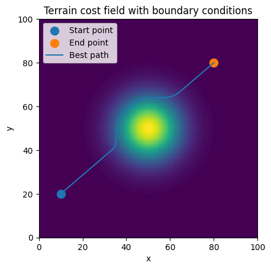

# Calculus of Variations for Terrain Path Planning

**Application of the Direct Method of the Calculus of Variations to a Terrain Path-Planning Problem with Numerical Experiments Using Simulated Annealing**

This project accompanies my MSc Mathematics dissertation at Cardiff University. It investigates a path-planning problem using the **Calculus of Variations**, combining analytical existence results with a numerical optimisation method based on **Simulated Annealing**.

The aim is to find a path between two fixed points that balances three competing costs:

* 🏔️ **Terrain cost** — avoiding expensive or difficult terrain such as hills
* 📐 **Curvature cost** — discouraging excessively sharp changes in direction
* 📏 **Length cost** — favouring shorter paths

A useful real-world analogy is the planning of a **railway or motorway**, where a route should be reasonably short, relatively straight, and avoid costly terrain.

---

## Example Result

The numerical experiments begin with a straight-line path between two fixed endpoints. Simulated Annealing then modifies the path iteratively, searching for a lower-cost solution.

The resulting path learns to move around the hill while balancing terrain, curvature, and length costs.



---

## Mathematical Approach

The problem is formulated as a functional of the form

$$
J[\gamma] = \int_{\gamma} \left( w_c\,c(\gamma(s)) + \lambda |\gamma''(s)|^2 + \mu \right \, ds
$$

where:

- $\gamma$ is the path,
- $c(\gamma)$ is the terrain cost,
- $w_c$ controls the importance of terrain,
- $\lambda$ controls the curvature penalty,
- $\mu$ controls the length penalty.

The problem is considered over an appropriate Sobolev space, allowing the **Direct Method of the Calculus of Variations** to be used to establish the existence of a minimiser.

### Classical Method

The project first considers the Classical Method of the Calculus of Variations. Applying the Euler–Lagrange equation leads to a **fourth-order nonlinear ODE**.

In general, this equation cannot be solved explicitly, motivating an alternative approach.

### Direct Method

The Direct Method provides a way to establish that a minimising path exists without explicitly solving the Euler–Lagrange equation.

The dissertation develops an existence proof using:

* Sobolev spaces
* Coercivity
* Weak convergence
* Lower semicontinuity
* Compact embeddings
* Convexity

The proof is developed in detail for a rational terrain-cost function.

---

## Numerical Optimisation

Once the existence of a minimiser has been established, the project turns to numerical optimisation.

A **Simulated Annealing** algorithm is implemented in Python to search for an approximate minimising path.

The algorithm:

1. Starts with a straight-line path between the fixed endpoints.
2. Makes a small random modification to the path.
3. Evaluates the new path's cost.
4. Accepts lower-cost paths.
5. Occasionally accepts higher-cost paths, allowing the algorithm to escape local minima.
6. Gradually reduces the temperature, making the search increasingly selective.

The standard random perturbation approach was modified during experimentation to produce more effective path exploration. In particular, **cost-weighted segmented movements** were introduced to allow the algorithm to make more meaningful changes to the path.

This produced paths that were able to navigate around the terrain feature while remaining constrained by the curvature and length penalties.

---

## Project Structure

```text
.
├── dissertation/
│   ├── figures/
│   │   └── FullResults.png
│   └── ...
│
├── numerical/
│   ├── ...
│   └── ...
│
├── README.md
└── ...
```

The `numerical/` directory contains the Python code and numerical experiments used in the dissertation.

The `dissertation/` directory contains material relating to the written dissertation, including figures.

---

## Technologies

The numerical experiments were developed primarily using:

* **Python**
* NumPy
* Matplotlib
* Jupyter Notebooks

The dissertation was written using **LaTeX**.

---

## Key Findings

The project demonstrates two complementary aspects of the problem.

### Analytical

The Direct Method can be used to prove the existence of a minimising path for the formulated problem. This is important because the existence of an optimum is not automatically guaranteed simply from writing down an optimisation problem.

The dissertation also provides a tutorial-style introduction to applying the Direct Method to this type of higher-order variational problem.

### Numerical

The Simulated Annealing experiments demonstrate that a stochastic optimisation method can produce sensible approximate solutions to the path-planning problem.

After modifying the way candidate paths were generated, the algorithm was able to find paths that:

* avoid high-cost terrain,
* remain relatively smooth,
* and avoid unnecessary increases in path length.

The numerical model is intended as a **proof of concept** rather than a complete real-world route-planning system.

---

## Limitations

Several simplifications were made to keep the problem mathematically and computationally manageable.

These include:

* A simplified artificial terrain model.
* A two-dimensional representation of the terrain.
* Heuristically selected optimisation parameters.
* A finite-difference approximation for the curvature term in the numerical implementation.
* No guarantee that Simulated Annealing finds the global minimiser.
* Simplified movement rules for generating candidate paths.

Consequently, the numerical results should be interpreted as demonstrating the behaviour of the proposed model and optimisation approach rather than as a practical infrastructure-planning system.

---

## Future Work

There are several natural directions in which the project could be extended.

### 🌍 Real-World Data

Use **OpenStreetMap** and other geographical data to investigate whether the algorithm can be applied to real terrain and infrastructure.

An interesting comparison would be to compare routes generated by the optimisation algorithm with existing railway lines.

### 🏔️ Three-Dimensional Terrain

Extend the model to incorporate elevation explicitly.

This would allow additional considerations such as:

* terrain gradients,
* tunnels,
* bridges,
* elevation changes,
* and construction costs.

### ⚙️ Systematic Parameter Tuning

The parameters used in the numerical experiments were selected primarily through experimentation.

A more systematic parameter-selection process could investigate how the relative weights of terrain, curvature, and length affect the resulting path.

---

## Dissertation

This project was developed as part of my **MSc Mathematics dissertation at Cardiff University**.

**Title:**

> *Application of the Direct Method of the Calculus of Variations to a Terrain Path-Planning Problem with Numerical Experiments Using Simulated Annealing*

The dissertation develops the mathematical theory behind the model, proves the existence of a minimiser using the Direct Method, and investigates the numerical behaviour of Simulated Annealing.

---

## Author

**Daniel Skerman**

MSc Mathematics — Cardiff University

[GitHub](https://github.com/skermind)
[Portfolio](https://danielskerman.com)

---

## Citation

If you use this project or its code, please cite:

```bibtex
@misc{skerman2026calculus,
  author = {Skerman, Daniel},
  title = {Application of the Direct Method of the Calculus of Variations
           to a Terrain Path-Planning Problem with Numerical Experiments
           Using Simulated Annealing},
  year = {2026},
  publisher = {Cardiff University}
}
```

---

## Licence

This project is primarily intended for educational and research purposes.
